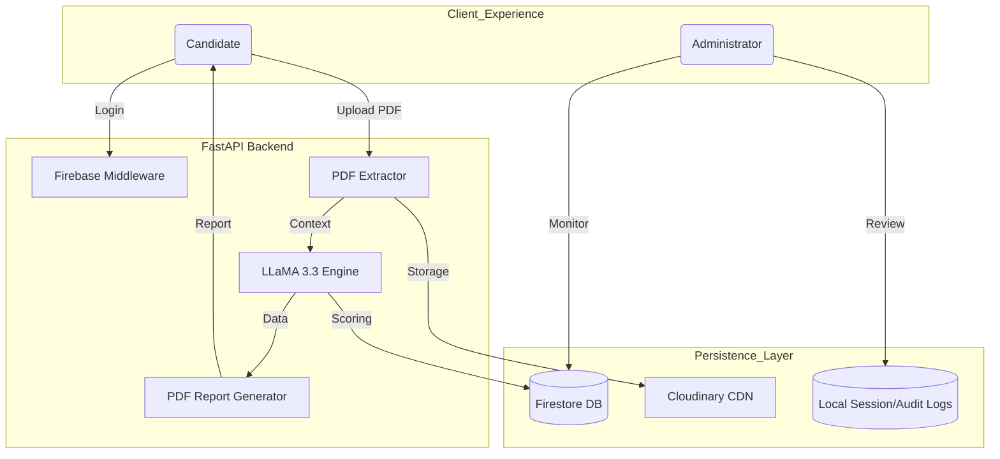
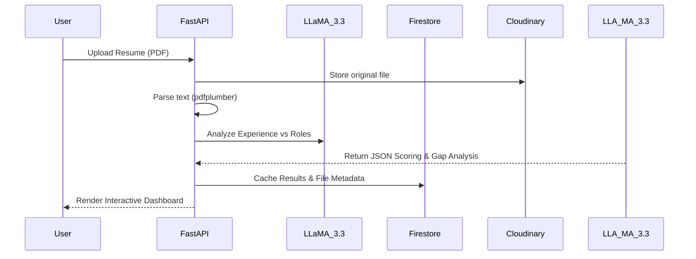

# 🚀 Career Copilot AI: Strategic Career Intelligence Suite

[](https://www.python.org/)
[](https://fastapi.tiangolo.com/)
[](https://firebase.google.com/)
[](https://cloudinary.com/)
[](https://groq.com/)

---

## 📖 Project Description
**Career Copilot AI** is a professional-grade career optimization platform that integrates Large Language Models (LLMs) with cloud-native infrastructure to transform static resumes into strategic career assets. 

In a modern job market driven by ATS and precise role-fit, Career Copilot provides job seekers with **semantic analysis**, **predictive interview intelligence**, and **automated asset generation**. It doesn't just scan for keywords; it understands the *intent* and *impact* of a user's professional journey, bridging the gap between current experience and future goals.

---

## ✨ Detailed Features

### 🔍 **1. Cognitive Resume Auditing**
- **Semantic Pathfinding**: Uses LLaMA 3.3 to benchmark your resume against 12+ industry-specific roles (AI Engineer, Product Manager, DevOps, etc.).
- **Affinity Scoring**: A weighted percentage match based on technical skills, soft skills, and leadership experience.
- **Skill Gap Mapping**: Identifies "Critical Missing Keywords" and provides a prioritized learning roadmap with curated resources.

### 🎤 **2. Predictive Interview Intelligence**
- **Resume-Contextual Questions**: AI analyzes your specific projects and tenure to generate the exact questions a recruiter is likely to ask *you*.
- **STAR Framework Guidance**: Interactive tips for structuring behavioral answers that emphasize impact and results.
- **On-Demand Generation**: Use the AJAX-powered engine to generate fresh questions any time you refresh your strategy.

### 📄 **3. Automated Professional Assets**
- **High-Conversion Cover Letters**: Generates context-aware letters that map your unique achievements directly to a job description.
- **Career Analysis Reports**: Downloadable, high-fidelity PDF reports featuring role-fit charts and detailed strategic advice.

### 📊 **4. Admin Intelligence Dashboard**
- **Live Monitoring**: Real-time visibility into user growth, file uploads, and system interactions.
- **Audit Logging**: A robust internal tracking system that captures logins and system changes for security.
- **Feedback Loop**: Integrated user feedback system with full CSV export capabilities for administrative review.

---

## 🛠️ Tech Stack

### Languages

- **Python 3.12+** – Core backend development and AI orchestration
- **JavaScript (ES6+)** – Client-side interactivity and dynamic updates
- **HTML5 & CSS3** – Web interface structure and styling

### Frameworks & Libraries

- **FastAPI** – High-performance asynchronous backend framework
- **Tailwind CSS** – Modern UI design and styling
- **Jinja2** – Dynamic HTML templating
- **ReportLab** – PDF report generation
- **Matplotlib** – Data visualization and charts
- **pdfplumber** – Resume text extraction from PDFs
- **Gunicorn** – Production server for deployment

### Cloud & Platforms

- **Railway** – Application deployment and hosting
- **Google Cloud Platform (GCP)** – Cloud infrastructure services
- **Firebase Authentication** – Secure Google login
- **Cloudinary** – Resume storage and file management

### Databases

- **Google Cloud Firestore** – NoSQL database for user data and metadata
- **ChromaDB** – Vector database for semantic search and AI retrieval
- **CSV / JSON Storage** – Lightweight local persistence

### APIs & AI

- **Groq Cloud API** – Fast LLM inference
- **LLaMA 3 (70B)** – Resume analysis and career guidance
- **Firebase Admin SDK** – Backend authentication integration
- **Cloudinary Upload API** – File upload and storage

### Dev Tools

- **Git & GitHub** – Version control
- **pip** – Dependency management
- **python-dotenv** – Environment variable management
- **Mermaid.js** – Architecture diagrams
---
## 🏗️ Detailed Architecture

### **System Data Flow**


### **Analysis Pipeline**


---

## 🚀 Installation

### 1. Requirements
- Python 3.12+
- Node/NPM (Optional for Tailwind development)

### 2. Local Setup
```bash
# Clone the repository
git clone https://github.com/tisha-varma/Career-Copilot.git
cd Career-Copilot

# Create and activate virtual environment
python -m venv .venv
source .venv/bin/activate  # Windows: .venv\Scripts\activate

# Install dependencies
pip install -r requirements.txt
```

---

## 🔑 Environment Variables

Create a `.env` file in the project root:

```env
# AI Intelligence
GROQ_API_KEY=your_groq_cloud_key

# Asset Hosting
CLOUDINARY_URL=your_cloudinary_url

# Identity & Security
ADMIN_EMAILS=user1@gmail.com,user2@gmail.com
SESSIONS_DIR=_sessions

# Firebase Setup
# Ensure firebase-adminsdk.json is present in /app directory
```

---

## 🖥️ Usage

1. **Identity**: Sign in with Google to create your personalized profile.
2. **Analysis**: Upload your PDF resume. The system will benchmark you against market standards.
3. **Strategize**: Review your role-fit score and technical gap analysis.
4. **Prepare**: Use the "Interview Prep" section to generate AI-tailored questions for your target role.
5. **Generate**: Create cover letters and download your comprehensive Career Analysis Report.

---

## 🔌 API Endpoints (Core)

| Endpoint | Method | Description |
| :--- | :--- | :--- |
| `/analyze` | POST | Parses resume and generates full career insights |
| `/download-report` | GET | Generates and exports the Career Analysis PDF |
| `/generate-resume-questions` | GET | AJAX endpoint for AI question prep |
| `/submit-feedback` | POST | Submits user ratings for system improvement |
| `/admin/dashboard` | GET | **(Admin)** Central monitoring command center |
| `/admin/delete-user/{uid}` | DELETE | **(Admin)** Secure profile removal |

---

## 🖼️ Screenshots Section

> [!NOTE]
> Add production screenshots here to showcase the premium Glassmorphism UI of the Landing Page, Dashboard, and Analysis Reports.

---

## 📂 Folder Structure

```text
Career-Copilot/
├── app/                     # Main Application Logic
│   ├── main.py              # Central Router & Lifecycle
│   ├── llama_analyzer.py    # LLM Analysis Logic
│   ├── firestore_db.py      # Firestore Repository
│   ├── cloudinary_storage.py# Asset Hosting Service
│   ├── report_generator.py  # ReportLab Orchestration
│   ├── audit.py             # Internal System Logging
│   ├── static/              # Visual CSS/JS Assets
│   └── templates/           # Jinja2 Dashboard Layouts
├── data/                    # Feedback and Local Sessions
└── requirements.txt         # Core Dependencies
```

---

## 🔮 Future Improvements
- [ ] **ATS Optimization Score**: A dedicated feature to maximize resume pass-through.
- [ ] **Mock Voice Interviews**: Integration with ElevenLabs for roleplay simulations.
- [ ] **Browser Extensions**: Quick analyze features for LinkedIn job postings.

---

## 🤝 Contributing
Contributions are welcome! Please follow these steps:
1. Fork the Project
2. Create your Feature Branch (`git checkout -b feature/AmazingFeature`)
3. Commit your Changes (`git commit -m 'Add some AmazingFeature'`)
4. Push to the Branch (`git push origin feature/AmazingFeature`)
5. Open a Pull Request

---

## ⚖️ License
Distributed under the **MIT License**. See `LICENSE` for more information.

---

Built with ❤️ by **Tisha Varma**. Helping the world navigate the future of work.
