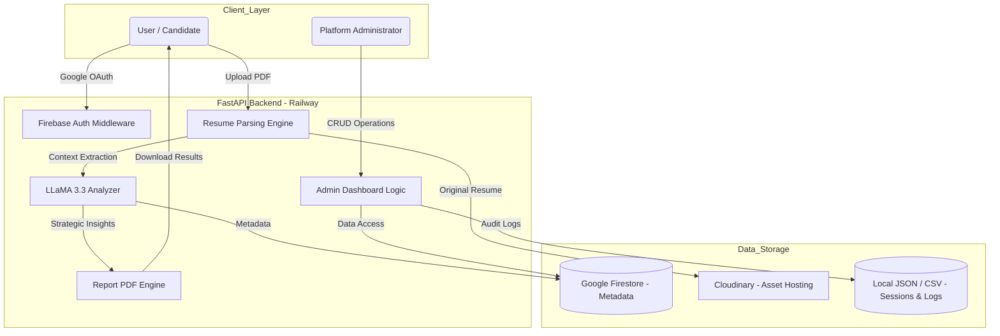
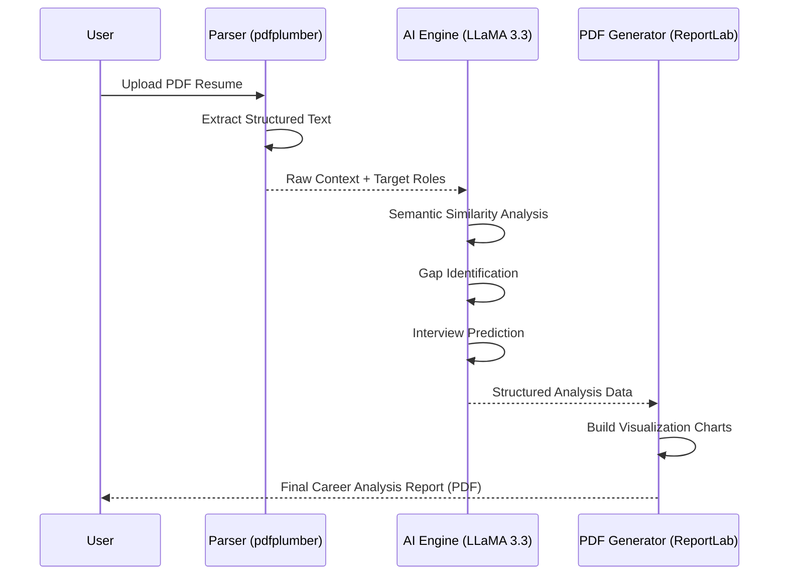

# 🚀 Career Copilot AI: Strategic AI Career Intelligence

[](https://www.python.org/)
[](https://fastapi.tiangolo.com/)
[](https://firebase.google.com/)
[](https://cloudinary.com/)
[](https://groq.com/)

**Career Copilot AI** is a professional-grade career optimization platform that leverages Large Language Models (LLMs) to transform static resumes into strategic career assets. By combining high-speed AI inference with cloud-native persistence, it provides job seekers with deep analysis, precision fit-scoring, and personalized interview intelligence.

---

## 🏗️ System Architecture & Data Flow

The system is built on a modern, asynchronous architecture designed for high performance and scalability.

### 1. High-Level Architecture


### 2. AI Intelligence Pipeline


---

## ✨ Key Features

### 📊 **Diagnostic Intelligence**
- **Semantic Affinity Scoring**: Analyzes resumes against 12+ industry sectors using semantic mapping rather than simple keyword matching.
- **Skill-Gap Pathfinding**: Identifies specific technical and soft skill deficits and provides a prioritized acquisition roadmap.
- **Role-Aware Optimization**: Benchmarks experience against roles such as AI Engineer, Full-Stack Dev, Data Scientist, and Product Manager.

### 🎤 **Strategic Interview Prep**
- **Predictive Behavioral Q&A**: Generates questions based on the unique intersection of a user's background and their target role requirements.
- **STAR Method Integration**: Provides expert tips for structuring high-impact answers.
- **Curated Learning**: Mapped YouTube resources for instant skill reinforcement.

### 🔐 **Enterprise Infrastructure**
- **Google OAuth 2.0**: Secure authentication via Firebase, ensuring user data privacy.
- **Cloud-Native Persistence**: Distributed storage using **Google Firestore** and **Cloudinary** for resilient asset management.
- **Real-Time Audit Trail**: Internal logging of all critical system actions for monitoring and security.

---

## 🛠️ Tech Stack

- **Core Framework**: [FastAPI](https://fastapi.tiangolo.com/) (High-performance Async Python)
- **AI/LLM Engine**: [LLaMA 3.3 (70B)](https://groq.com/) via Groq Cloud
- **Global Auth**: [Firebase Authentication](https://firebase.google.com/hub) (Google Login 3rd Party Provider)
- **Primary Data Store**: [Google Cloud Firestore](https://firebase.google.com/docs/firestore) (NoSQL)
- **Asset Storage**: [Cloudinary](https://cloudinary.com/) (MIME-optimized resume hosting)
- **Data Visualization**: [Matplotlib](https://matplotlib.org/) & [ReportLab](https://pypi.org/project/reportlab/)
- **UI Architecture**: Tailwind CSS & Jinja2 Template Engine

---

## 📂 Project Structure

```text
career-copilot/
├── app/
│   ├── main.py              # Central Routing & Lifecycle Management
│   ├── llama_analyzer.py    # LLM Prompt Engineering & Analysis
│   ├── firestore_db.py      # Firestore Collection Management
│   ├── firebase_auth.py     # OAuth Helper & User Session Logic
│   ├── cloudinary_storage.py # Cloud Asset Management (MIME-aware)
│   ├── report_generator.py  # Precision PDF Logic (ReportLab)
│   ├── pdf_generator.py     # Asset Generation (Cover Letters)
│   ├── audit.py             # System Logging & Audit Trail
│   ├── static/              # Tailwind CSS & Interactive JS
│   └── templates/           # UI Components & Admin Dashboard
├── data/                    # Local State (Feedback & Sessions)
├── Procfile                 # Production Build Config (Railway)
├── requirements.txt         # Dependency Manifest
└── README.md                # System Documentation
```

---

## 🚀 Installation & Setup

### 1. Prerequisites
- Python 3.12+
- Google Cloud / Firebase Account
- Cloudinary Account
- Groq Cloud API Key

### 2. Deployment Steps
```bash
git clone https://github.com/tisha-varma/Career-Copilot.git
cd Career-Copilot
pip install -r requirements.txt
```

### 3. Identity & Credentials
Create a `.env` file in the root:
```env
GROQ_API_KEY=your_groq_key
CLOUDINARY_URL=your_cloudinary_url
ADMIN_EMAILS=admin@example.com
# Place your Firebase Admin SDK JSON in the /app folder
```

### 4. Direct Launch
```bash
cd app
python main.py
```
Open `http://localhost:8000` to access the platform.

---

## 📊 Administrator Intelligence Suite

The system features a centralized **Administrator Dashboard** for real-time monitoring:
- **User Discovery**: Track user registration and profile trends.
- **Audit Monitoring**: Live visibility into critical system events and security logs.
- **Feedback Management**: Analyze user satisfaction with integrated CSV export.
- **Asset Governance**: Direct CRUD control over user profiles and stored resumes.

---

## 🤝 Contributors
Developed with precision by **Tisha Varma**. Focused on bridging the gap between talent and opportunity through advanced AI.

---

*Project created for technical demonstration and career empowerment.*
